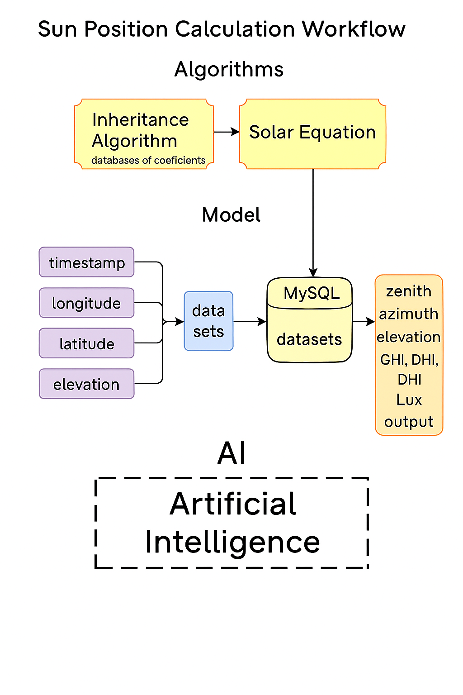

# **Inheritance Algorithm มีอะไรบ้าง**
**นี่คือสูตร/พารามิเตอร์ที่ใช้เป็นฐานความรู้จากงานวิจัยหรือ empirical data:**
| อัลกอริทึ่ม           | ใช้ทำอะไร                                  | อ้างอิง                                  |
|-------------------|-------------------------------------------|-----------------------------------------|
| Linke Turbidity   | ค่าความขุ่นของบรรยากาศ                       | Ineichen & Perez (2002)                 |
| Extraterrestrial Irradiance | ค่ารังสีจากดวงอาทิตย์นอกชั้นบรรยากาศ         | ASTM G173                               |
| Air Mass Models   | คำนวณความหนาของชั้นบรรยากาศที่แสงผ่าน       | Kasten & Young (1989), Gueymard           |
| Luminous Efficacy | แปลง W/m² → Lux                              | Empirical (เช่น 115 lm/W)               |

# **Solar Equation มีอะไรบ้าง**
**นี่คือสูตรที่ใช้คำนวณตำแหน่งดวงอาทิตย์จาก input:**
| อัลกอริทึ่ม                        | ใช้ทำอะไร                                       | อ้างอิง                                   |
|-----------------------------------|------------------------------------------------|------------------------------------------|
| SPA (Solar Position Algorithm)    | คำนวณ zenith, azimuth, elevation             | Reda & Andreas (NREL, 2008)              |
| Ephemeris                         | คำนวณตำแหน่งดวงอาทิตย์จากดาราศาสตร์          | Meeus                                    |
| Solar Declination & Hour Angle    | ใช้ในสูตรพื้นฐานของ sun position               | ดาราศาสตร์พื้นฐาน                          |

## **Clear-Sky Irradiance**
**องค์ประกอบของรังสีอาทิตย์ในสภาวะท้องฟ้าโปร่ง:**

*   **ghi (Global Horizontal Irradiance):** ปริมาณรังสีอาทิตย์รวมบนพื้นผิวแนวนอน

*   **dni (Direct Normal Irradiance):** ปริมาณรังสีอาทิตย์โดยตรงที่ตั้งฉากกับพื้นผิว

*   **dhi (Diffuse Horizontal Irradiance):** ปริมาณรังสีอาทิตย์แบบกระจายบนพื้นผิวแนวนอน

## บรรณานุกรม

*   Ineichen & Perez (2002): [https://www.researchgate.net/publication/228846448_A_new_airmass_independent_formulation_for_the_Linke_turbidity_coefficient](https://www.researchgate.net/publication/228846448_A_new_airmass_independent_formulation_for_the_Linke_turbidity_coefficient)
*   ASTM G173: [https://www.astm.org/g0173-03r22.html](https://www.astm.org/g0173-03r22.html)
*   Kasten & Young (1989):  (หา link เพิ่มเติม)
*   Gueymard: (หา link เพิ่มเติม)
*   Reda & Andreas (NREL, 2008): [https://www.nrel.gov/solar/pubs/solpos/](https://www.nrel.gov/solar/pubs/solpos/)
*   Meeus: (หา link เพิ่มเติม)
